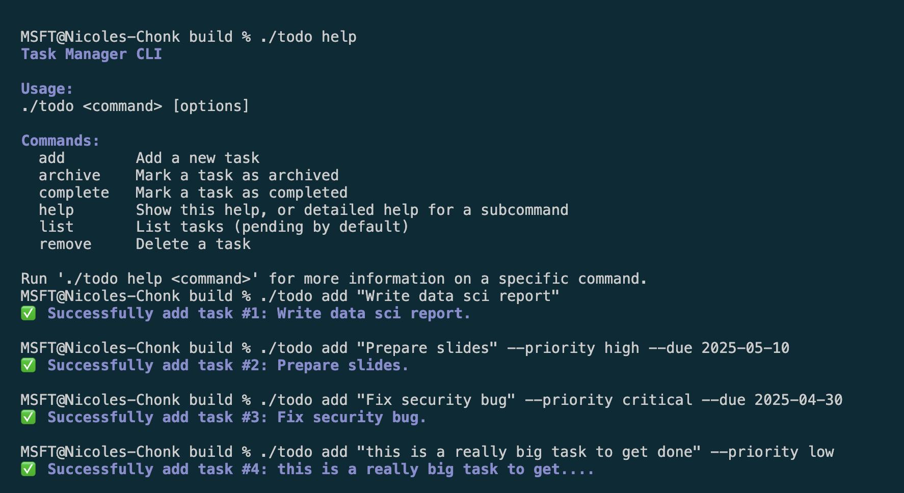
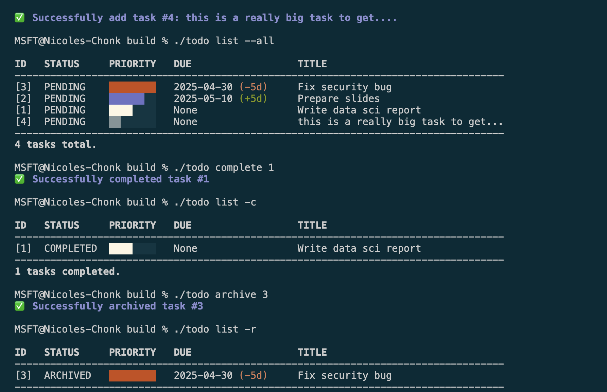
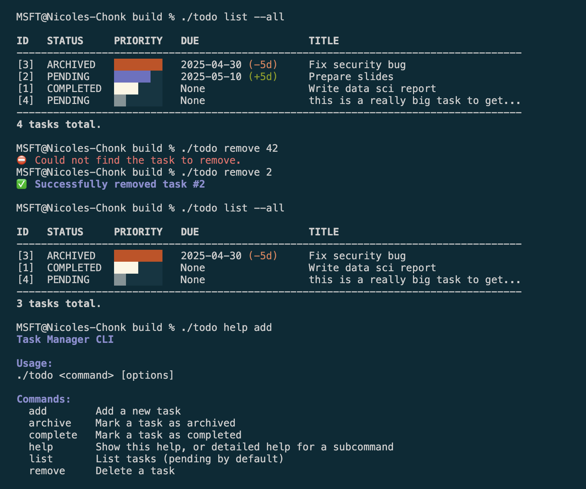

# Task Manager++

A simple command-line to-do list manager written in modern C++20. It stores tasks in a JSON file and provides commands to add, archive, list, complete, and remove tasks with priorities and due dates.

## Features
- Add tasks with a title, priority (low, med, high, critical), and optional due date (YYYY-MM-DD).
- List tasks (pending by default), or filter by all/completed/archived.
- Mark tasks as completed.
- Remove tasks.
- Persistent storage to tasks.json using JSON format.

## Setup & Build
Ensure you have CMake and a C++20-compatible compiler installed. [^1]
```ruby
# From project root:
rm -rf build
cmake -S . -B build -DCMAKE_BUILD_TYPE=Debug
cmake --build build
```

## Running
The compiled binary is located at:
```ruby
build/todo <command>
```
You can also run the tests locally:
```ruby
build/unit_tests
```

## Usage
### add
Add a new task.
```ruby
./todo add "TITLE" [--priority <low|med|high|crit>] [--due YYYY-MM-DD]
```
- **title**: Task title (in quotes).
- **priority**: Task priority (default: med).
- **due**: Due date in ISO-8601 format.

### list
List tasks.
```ruby
./todo list [all|completed|archived]
```
No subcommand (or list) shows pending tasks.

- `list all` shows every task.
- `list --completed `shows only completed tasks.
- `list --archived` shows archived tasks (if supported).

### complete
Mark a task as completed.
```ruby
./todo complete <ID>
```

- **ID**: Numeric task identifier.

### remove
Delete a task.
```ruby
./todo remove <ID>
```
- **ID**: Numeric task identifier.

### help
Display help information.
```ruby
./todo help [command]
```
Without arguments, prints overall help.

- `todo help add` prints add-specific usage.

## Examples




## Implementation Details
- **Storage:** Tasks are stored in an `unordered_map<int, std::unique_ptr<Task>>` (task_map) for O(1) lookup by ID.
- **Ordering:** A `priority_queue<Task*, vector<Task*>, TaskComparator>` holds raw pointers into task_map so tasks can be listed by due date and priority without copying. Tasks are sorted based on scores computed from their assigned priority + distance from due date. Overdue items are moved higher up on the list.
- **Date handling:** Uses C++20’s `<chrono> year_month_day` for dates and helper functions to parse/stringify.
- **Persistence:** `loadFromFile("tasks.json")` and `saveToFile("tasks.json")` wrap JSON serialization.

## Future Work
- **Interactive CLI:** User can run the program and execute multiple commands instead of relying on one-shot mode.
- **Remove All:** Instead of just removing one task at a time, this would support `todo remove --all`. Would ask user to confirm the action first.
- **Edit Task:** Instead of just removing tasks, they could modify its date, priority, etc.
- **Advanced Input Handling:** Right now, we make a lot of assumptions about how input is passed to the program. In the future, more advanced parsing and more input options would be great. For example, you have to pass in a date as YYYY-MM-DD when it would be cool to also support `May 23, 2000`.
- **Command-Line Interface:** Given more time, I'd also play around with other ways of displaying the information about the tasks.

## Tips
> [!TIP] 
> To make building the project easier, create the following `.vscode/tasks.json` file. 
> You can then just use **SHIFT + CTRL + B** in VS Code to automatically build.
> 
```ruby
// .vscode/tasks.json
{
  "version": "2.0.0",
  "tasks": [
    {
      "label": "build", // ⇧⌘B  (or Ctrl+Shift+B) runs this
      "type": "shell",
      "command": "bash",
      "args": [
        "-c",
        // 1) wipe old build, 2) configure, 3) compile
        "rm -rf build && cmake -S . -B build -DCMAKE_BUILD_TYPE=Debug && cmake --build build"
      ],
      "problemMatcher": ["$gcc", "$msCompile"], // parse GCC/Clang/MSVC errors
      "group": {
        "kind": "build",
        "isDefault": true
      }
    },

    {
      "label": "test",
      "type": "shell",
      "dependsOn": "build", // always (re)compile first
      "command": "ctest",
      "args": ["--test-dir", "build", "--output-on-failure"],
      "problemMatcher": [],
      "group": "test"
    }
  ]
}
```